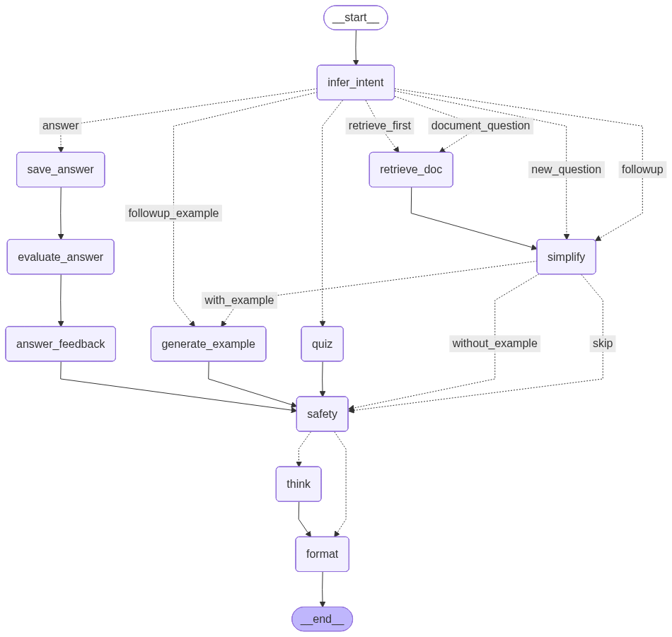

# AgeXplain — Adaptive Learning Edition

A **Streamlit frontend + FastAPI backend** version of **AgeXplain**, an age-adaptive multi-agent educational assistant.  
Explains any topic at the learner's level, supports document Q&A with RAG, and includes interactive quizzes. Backend and frontend are decoupled and fully parity-tested with the React-based `agexplain` reference implementation.

---

## Features

- **Age-adaptive explanations** — vocabulary and depth auto-adjust to the learner's age (5–35)
- **Multi-section responses** — Explanation, Example, Thought Question, and Answer Feedback sections
- **Document Q&A (RAG)** — upload PDF / DOCX / TXT / MD / CSV / HTML; hybrid FAISS + BM25 retrieval
- **Topic-aware quizzes** — free-topic or document-grounded quizzes with per-question feedback
- **Learner profile** — Profession, Expertise Level, Area of Interest, and Character sliders tune every response
- **Multi-provider LLM support** — Local (Ollama), OpenAI, Gemini, Claude, or GitHub Copilot
- **Topic packs** — curated topic collections for quick exploration
- **Three-panel layout** — chat history sidebar | chat area | settings panel
- **Safety agent** — validates generated content for age-appropriateness
- **FastAPI backend** — modular, async-ready, documented REST endpoints for all features
- **LangGraph orchestration** — multi-agent workflow with intent detection, retrieval, and safety guardrails
- **Config-driven** — single `config.json` governs backend host, port, CORS, and provider defaults

---

## Project Structure

```
adaptive-learning/
├── config.json             # Root configuration (host, port, CORS, provider URLs)
├── app.py                  # Streamlit UI entry point
├── main.py                 # FastAPI app bootstrap & middleware
├── graph.py                # LangGraph multi-agent graph definition
│
├── agents/                 # Individual LangGraph agent nodes
│   ├── intent_agent.py
│   ├── safety_agent.py
│   ├── simplify_agent.py
│   ├── answer_feedback_agent.py
│   ├── format_agent.py
│   ├── quiz_agent.py
│   ├── retrieve_doc_agent.py
│   └── think_question_agent.py
│
├── api/                    # FastAPI routes
│   ├── routes.py           # /topics, /models/validate, /quiz/generate, /documents/*, /explain/*
│   └── example_client.py   # Reference client for API integration
│
├── configs/
│   ├── config.py           # LLM provider config & context manager
│   ├── model_registry.py   # Model fallback chains
│   └── models.py           # Pydantic request/response models
│
├── services/
│   ├── document_service.py # Text extraction & map-reduce summarization
│   ├── rag_service.py      # FAISS + BM25 hybrid RAG
│   ├── model_provider.py   # Multi-provider LLM factory
│   ├── intent_service.py
│   ├── tts_service.py      # Text-to-speech audio synthesis
│   └── json_logger.py      # Structured event logging
│
├── db/
│   └── database.py         # SQLite document persistence
│
├── css/
│   └── styles.css          # Streamlit custom styling
│
├── requirements.txt        # All dependencies
├── requirements_backend.txt # Backend-only dependencies (subset)
├── venv/                   # Python virtual environment
└── README.md               # This file
```

---

---

## Agents Flow



---

## Prerequisites

| Requirement | Version |
|---|---|
| Python | 3.9 or higher |
| pip | Latest recommended |
| Node.js *(optional, for frontend development)* | 16+ |
| Ollama *(for local LLM)* | [ollama.ai](https://ollama.ai) with `llama3.1:8b` pulled |

---

## Setup

### 1. Enter the project directory

```bash
cd adaptive-learning
```

### 2. Create the virtual environment

```bash
python3.14 -m venv venv
```

### 3. Activate the virtual environment

```bash
source venv/bin/activate
```

On Windows:

```bash
venv\Scripts\activate
```

### 4. Install dependencies (safe to run again)

```bash
pip install -r requirements.txt
```

### 5. Confirm `config.json` values

Make sure these values are set:

```json
{
  "backend": {
    "host": "127.0.0.1",
    "port": 8001,
    "cors_origins": [
      "http://127.0.0.1:8501",
      "http://localhost:8501"
    ]
  },
  "frontend": {
    "dev_port": 8501
  }
}
```

### 6. Optional `.env` for cloud providers

```env
OPENAI_API_KEY=...
GEMINI_API_KEY=...
ANTHROPIC_API_KEY=...
GITHUB_TOKEN=...
```

### 7. Optional local model (Ollama)

```bash
ollama pull llama3.1:8b
```

---

## Running

### Recommended: one command for backend + frontend

```bash
python start_all.py
```

What this does:
- Starts backend first
- Waits until backend is actually listening
- Starts frontend next
- Waits until frontend is actually listening
- Prints success only after both are ready

Default URLs:
- Frontend: http://localhost:8501
- Backend: http://127.0.0.1:8001
- API docs: http://127.0.0.1:8001/docs

Stop both services with `Ctrl+C` in the same terminal.

### Frontend-only mode

```bash
python run_streamlit.py
```

This reads `frontend.dev_port` from `config.json` and runs Streamlit on that port.

### Backend-only mode

```bash
python main.py
```

---

## API Endpoints

All endpoints are REST-based and documented in the FastAPI `/docs` route.

| Method | Endpoint | Purpose |
|--------|----------|---------|
| `GET` | `/topics` | List available topics |
| `POST` | `/models/validate` | Validate LLM configuration |
| `POST` | `/quiz/generate` | Generate quiz questions on a topic |
| `POST` | `/documents/upload` | Upload and summarize a document |
| `POST` | `/documents/ask` | Ask a question about an uploaded document |
| `POST` | `/documents/summarize` | Re-summarize a document for a different age |
| `POST` | `/explain/stream` | Stream multi-section explanation as SSE |

Request/response bodies use Pydantic models defined in `configs/models.py`.

---

## Usage

### Chat
1. Type a topic or question in the input box at the bottom of the chat area.
2. The assistant returns an **Explanation**, **Example**, and **Question to Think About**.
3. Answer the question to get personalised **Feedback**.

### Document Q&A
1. Upload a file using the **Upload Document** section in the left sidebar.
2. An age-adapted summary is generated automatically.
3. Ask any question about the document — RAG retrieval grounds every answer.

### Quiz
1. After at least one message in a chat, click **🎯 Start Quiz**.
2. Configure topic, difficulty, and number of questions, then click **Generate Quiz**.
3. Answer each question; get immediate correct/incorrect feedback and explanations.
4. Review your full score and per-question breakdown at the end.

### Learner Profile Settings
In the right panel, customize:
- **Age** — affects vocabulary and explanation depth
- **Profession** — used for framing examples
- **Expertise Level** — Beginner, Intermediate, or Advanced
- **Area of Interest** — contextualizes wording without changing facts
- **Character** — Friendly Teacher, Stern Professor, Scientist, Pirate, etc.
- **Model Provider** — Local (Ollama), OpenAI, Gemini, Claude, or Copilot
- **API Key** — provider-specific authentication (if not in `.env`)

---

## Parity with `agexplain`

This project is fully parity-tested with the React-based [`agexplain`](../agexplain) reference implementation:

- **Backend modules** are byte-for-byte identical (except for config path handling to support adaptive-learning's layout).
- **API contracts** match exactly — same endpoints, same request/response models, same behavior.
- **Smoke tests** validate all six core flows (topics, model validation, quiz generation, document upload/ask, explain streaming).
- **Streamlit frontend** replicates React UX flows without using React — same features, same sequence, same outcome.

To verify parity, run:

```bash
./venv/bin/python .smoke_api.py
```

Expected output:
```
PASS GET /topics
PASS POST /models/validate
PASS POST /quiz/generate
PASS POST /documents/upload
PASS POST /documents/ask
PASS POST /explain/stream
SUMMARY PASS=6 FAIL=0
```

---

## Troubleshooting

### Streamlit won't find `streamlit` module
Ensure the venv is active:
```bash
source venv/bin/activate  # macOS / Linux
```

### Backend connection fails (`ConnectionError` from frontend)
Check that the FastAPI backend is running:
```bash
ps aux | grep 'python main.py'
```

If backend is not running, use the unified startup command:
```bash
python start_all.py
```

### Ollama model not found
Pull the required model:
```bash
ollama pull llama3.1:8b
```

Verify it's available:
```bash
ollama list
```

### Database locked error
The SQLite database (`../data/agexplain.db`) may be in use by another process. Close all running instances and retry.

---

## Development Notes

- **LangGraph graph** orchestrates the multi-agent workflow. See `graph.py` for routing logic.
- **Agents** are stateless; state is passed through the graph via dictionaries (not stored in agent classes).
- **RAG service** uses FAISS for dense retrieval and BM25 for sparse retrieval, combined via a simple heuristic.
- **Config context manager** (`use_request_llm`) ensures each request uses its own LLM instance without global state pollution.
- **Structured logging** via `json_logger.py` emits parseable JSON event lines for monitoring and debugging.

---

## License

See `../LICENSE` (or project-specific license file) for licensing information.

### Model Settings (right panel)
- **Provider** — switch between Local, OpenAI, Gemini, Claude, or Copilot at any time.
- **API Key** — enter the key for cloud providers (stored in session only, never persisted).
- **Test Connection** — validates the selected provider before sending messages.

### Profile Settings (right panel)
| Setting | Effect |
|---|---|
| **Explain Age** (slider) | Adjusts vocabulary complexity across all responses |
| **Profession** | Tailors analogies and framing |
| **Expertise Level** | Controls assumed background knowledge |
| **Example Context** | Sets the domain used in examples |

---

## Supported LLM Providers

| Provider | Config Key | Notes |
|---|---|---|
| Local (Ollama) | `local` | No API key; fully offline; requires `ollama` running |
| OpenAI | `openai` | GPT-4o with automatic model fallback |
| Google Gemini | `gemini` | Native Gemini API with fallback chain |
| Anthropic Claude | `claude` | Claude 3.x series with fallback chain |
| GitHub Copilot | `copilot` | Azure-hosted endpoint; requires `GITHUB_TOKEN` |

---

## Dependency Notes

- `click==8.1.8` — pinned to satisfy both `gTTS<8.2` and `typer==0.9.4`
- `typer==0.9.4` — pinned for `click<9.0.0` compatibility
- `torch` and `sentence-transformers` are required for FAISS dense retrieval

---

## Team

Group 12 — Drexel University  
- Deepak Saxena  
- Somasekhar Obulareddy  
- Shadik Khan
